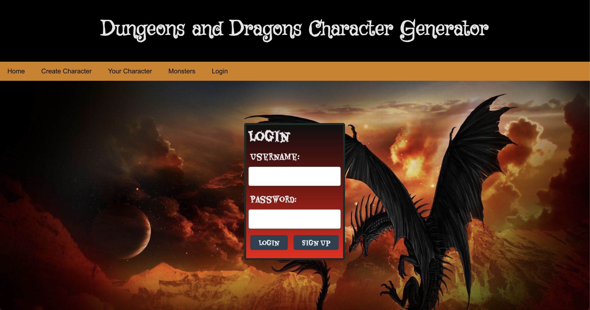

# DnD Character Creator

## Description

This application makes it easy for new Dungeons and Dragons players to generate a starting character. It also allows the user to login and access character sheets for previous characters. 

## Requirements

The user story and acceptance criteria will depend on the project that you create, but your project must fulfil the following requirements:

- Use Node.js and Express.js to create a RESTful API.
- Use Handlebars.js as the templating engine.
- Use MySQL and the Sequelize ORM for the database.
- Have both GET and POST routes for retrieving and adding new data.
- Be deployed using Heroku (with data).
- Use at least one new library, package, or technology that we haven’t discussed.
- Have a polished UI.
- Be responsive.
- Be interactive (i.e., accept and respond to user input).
- Have a folder structure that meets the MVC paradigm.
- Include authentication (express-session and cookies).
- Protect API keys and sensitive information with environment variables.
- Have a clean repository that meets quality coding standards (file structure, naming conventions, follows best practices for class/id naming conventions, indentation, quality comments, etc.).
- Have a quality README (with unique name, description, technologies used, screenshot, and link to deployed application).

## Technologies Used:

- Express
- NodeJS
- MySQL

## Screenshots

## Deployed Links

[Heroku](https://dnd-character-generator-app-3900836cda13.herokuapp.com/)

[GitHub](https://github.com/coding-bootcamp-project2/bootcamp-project2)

## Installation

In order to install, the user will have to use the link in Heroku. Otherwise, the user can download the code from GitHub and run the application locally. 

## Usage

The user can start on the homepage. From there they can log in to their account. If they'd like to view their characters, they can click the "your characters" link in the navigation bar. This will pull up a list of previous characters they have created.
If they would like to create a new character, they can click "create character" in the navigation bar. 
This will take them to a form where they will input a name and a race for their character. Then they will be prompted with a short quiz to determine which DnD class best suits their personality. 
Based on their answers to the quiz, the app will generate a starting class and stat block for them. 
This will then take them to a page where they can view their newly created character. 

## Credits

This project was a team effort between 4 collaborators:
- Hailong Zhou (David) 
- Steven Machin
- Tommy Henderson
- Jose Guzman

## License

Please refer to the license in the GitHub Repo. 